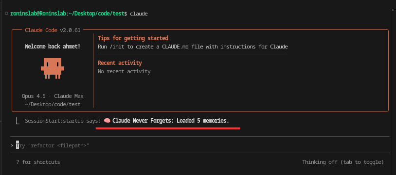

# Claude Never Forgets

A Claude Code plugin that provides persistent memory across sessions and context windows.



## Why

Claude Code's context window is limited to 200K tokens. During long coding sessions, earlier parts of your conversation get summarized or dropped. When you start a new session, Claude has no memory of your previous work.

This plugin saves important parts of your conversations to a local file and automatically loads them when you start a new session - so your preferences, decisions, and project context persist.

## Install

```bash
/plugin install yldrmahmet/claude-never-forgets
```

## How It Works

**Automatic saving:**
- Every user message and Claude response is saved
- Tool rejections (when you decline a suggested action) are captured as corrections
- Memories are stored in `.claude/memories/project_memory.json`

**Automatic loading:**
- When you start a new session, saved memories are loaded into context
- Claude sees your previous preferences and decisions

**Automatic cleanup:**
- When memories exceed 10 entries, Claude consolidates them
- Keeps important information (preferences, decisions, corrections)
- Removes noise (greetings, acknowledgments)
- The threshold (10) can be changed in `hooks/stop_cleanup.py`

## Commands

```bash
/remember [text]   # Manually add something to memory
/forget [text]     # Remove a specific memory
/memories          # View all stored memories
```

## Example

```
Session 1:
You: "Use pnpm instead of npm for this project"
Claude: *uses pnpm*
→ Saved to memory

Session 2 (next day):
🧠 Loaded 3 memories
You: "Install axios"
Claude: *runs pnpm add axios*
→ Remembered your preference
```

## Storage

Each project has its own memory file:

```
your-project/
└── .claude/
    └── memories/
        └── project_memory.json
```

You can:
- Commit it to git to share with your team
- Add it to .gitignore for personal preferences
- Edit it manually if needed

## Privacy

All memories are stored locally. Nothing is sent to external servers.

## License

MIT
